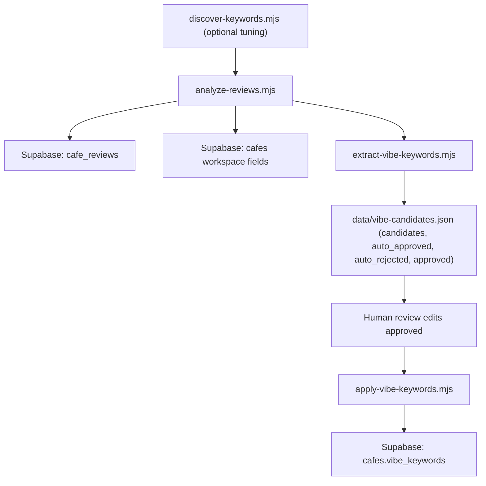

<!-- BEGIN:nextjs-agent-rules -->
# This is NOT the Next.js you know

This version has breaking changes — APIs, conventions, and file structure may all differ from your training data. Read the relevant guide in `node_modules/next/dist/docs/` before writing any code. Heed deprecation notices.
<!-- END:nextjs-agent-rules -->

## Needle Space Agent Architecture (.mjs sequence)

This project uses a script-first data pipeline with a human review step before publishing vibe keywords.

### High-level flow

1. Populate and refresh review corpus + workspace signals.
2. Extract vibe candidates from review text.
3. Human reviews and edits final approved keywords.
4. Publish approved keywords to Supabase.



### Script sequence

#### 0) Optional helper: discover/tune workspace keyword rules
- Script: `scripts/discover-keywords.mjs`
- Purpose: Explore review text patterns to improve scoring keywords in `scripts/analyze-reviews.mjs`.
- Typical usage: run when tuning signal keywords, not required on every batch.

#### 1) Review analysis + cafe workspace attributes
- Script: `scripts/analyze-reviews.mjs`
- Reads: `cafes` table (`id`, `name`, `google_place_id`, etc.)
- Fetches: Google reviews/summaries (relevant + newest sources)
- Writes:
  - `cafe_reviews` (upserted review corpus)
  - `cafes` workspace fields (wifi/outlets/noise/laptop/seating/productivity)
- Human step: optionally mark `verified=true` in Supabase after manual confirmation.

#### 2) Vibe candidate extraction
- Script: `scripts/extract-vibe-keywords.mjs`
- Reads:
  - `cafes` table (id/name/place_id)
  - Google review text + editorial summary
- Produces: `data/vibe-candidates.json` per cafe with:
  - `candidates` (raw extracted candidates)
  - `auto_approved` (automation-picked subset)
  - `auto_rejected` (automation-dropped subset)
  - `approved` (initially seeded from auto-approved; final human-editable field)

#### 3) Human-in-the-loop review (required)
- File: `data/vibe-candidates.json`
- Action:
  - Keep/remove items in `approved`
  - Add strong phrases from `candidates` when needed
- Important: `scripts/apply-vibe-keywords.mjs` uses `approved` as the source of truth.

#### 4) Publish vibe keywords
- Script: `scripts/apply-vibe-keywords.mjs`
- Reads: `data/vibe-candidates.json`
- Writes: `cafes.vibe_keywords` using each entry's `approved` array.

### Execution commands (typical batch)

```bash
# 1) Review/workspace updates
node scripts/analyze-reviews.mjs

# 2) Extract vibe candidates
node scripts/extract-vibe-keywords.mjs

# 3) Human review in data/vibe-candidates.json

# 4) Preview publish
node scripts/apply-vibe-keywords.mjs --dry-run

# 5) Publish
node scripts/apply-vibe-keywords.mjs
```

### Data ownership boundaries

- Automation-owned:
  - `cafe_reviews` corpus
  - workspace signal inference in `cafes`
  - `candidates`/`auto_*` generation in JSON
- Human-owned:
  - final `approved` arrays in `data/vibe-candidates.json`
  - optional manual `verified=true` in Supabase
